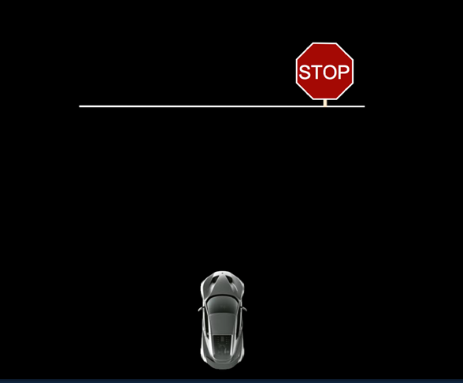

# README for the StimTool application

# *SUMMARY*

StimTool is a framework for running a series of behavioral tasks.
Each task is implemented as a separate module which is then called by StimTool.

# *INSTALL INSTRUCTIONS*
1) Install PsychoPy3

2) Install ASIO4ALL
	Right now, this is necessary to decrease sound latency.  You may not need to take this step depending on your sound card/drivers.
	ASIO4ALL_2_11_English.exe
	Test latency by running sound_test.py.
		An 'X' will appear and disappear a few times--there should also be a burst of white noise that occurs simultaneously if things are working properly.  If things are not, there may be a delay of ~400ms.

3) After installing psychopy, put StimTool-Driving under C:\
		
4) To run the driving task, either run StimTool-shortcut or open PsychoPy coder view, then open the StimTool.py script and run it.

**To change the number of trials, edit StimTool-Driving\Driving\DR_R1.schedule**
